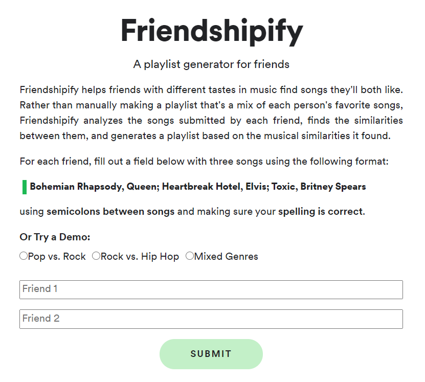

# Friendshipify

Friendshipify is a multi-user song recommender that generates a playlist based on the intersection of two users' music tastes.
This app was built using Flask and deployed using the standard environment of Google Cloud's App Engine.

* Try the app [here](https://friendshipify.com)
* Read about how I created the app [here](https://towardsdatascience.com/friendshipify-a-playlist-generator-for-friends-f79297f08b03)

## Purpose
Collaborative playlists are great for friends and families to create when hanging out, going on a road trip, or having a party. However, collaborative playlists require a lot of interaction. Each song is added one by one, and the playlist ends up containing each person’s favorite songs but not necessarily music that both users have in common. This situation can become especially dire if you’re on an hours-long road trip, and half the time you have to listen to music you don’t particularly like. Friendshipify can alleviate this problem by finding songs that both users can agree on and enjoy.

## Contents:
- Dependencies in `requirements.txt`
- Deployed using Google App Engine; settings in `app.yaml`
- Flask application: `server.py`
- App functions: `project_utils.py`
- `genre_replace.py` is a dictionary that maps Spotify's unique genres to more generalized genres

