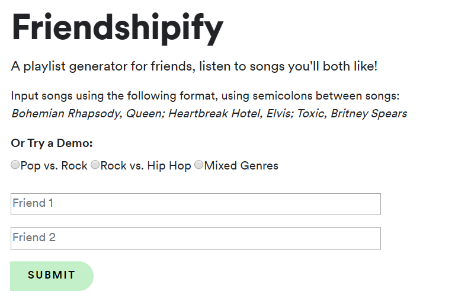

Friendshipify
======================================================

Friendshipify is a multi-user song recommender that generates a playlist based on the intersection of two users' music tastes.
This app was built using Flask and deployed using the standard environment of Google Cloud's App Engine.

Contents:
- Dependencies in `requirements.txt`
- Deployed using Google App Engine; settings in `app.yaml`
- Flask application: `server.py`
- App functions: `project_utils.py`
- `genre_replace.py` is a dictionary that maps Spotify's unique genres to more generalized genres
